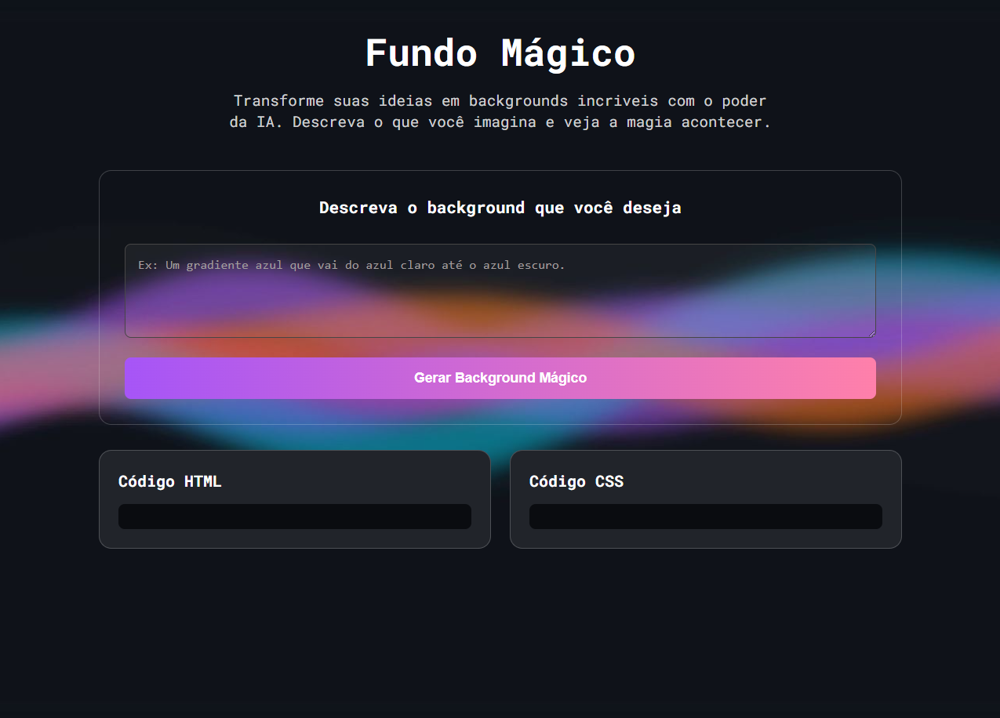
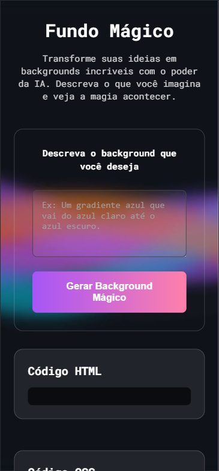

# Projeto Fundo Mágico

Projeto desenvolvido durante os estudos com os gêmeos do Dev em Dobro, com o objetivo de praticar integração entre Front-End e Inteligência Artificial, criando backgrounds personalizados a partir de descrições em texto.

## Índice
- [O projeto](#o-projeto)
- [Tecnologias Utilizadas](#tecnologias-utilizadas)
- [Objetivos do Projeto](#objetivos-do-Projeto)
- [Captura de tela](#captura-de-tela)
- [O que aprendi](#o-que-eu-aprendi)
- [Autor](#autor)
- [Agradecimentos](#agradecimentos)

## O Projeto

O Fundo Mágico é uma aplicação web que permite ao usuário descrever um background e receber automaticamente um resultado gerado por Inteligência Artificial.
Além da visualização em tempo real do background criado, a aplicação também exibe os códigos HTML e CSS utilizados na composição, proporcionando uma experiência prática para aprendizado e experimentação com desenvolvimento web e IA.

### Tecnologias Utilizadas

- HTML5
- CSS3
- JavaScript
- Fetch API
- N8N
- Git
- GitHub

### Objetivos do Projeto

- Praticar manipulação do DOM;
- Trabalhar com requisições assíncronas utilizando Fetch API;
- Integrar aplicações Front-End com automações no N8N;
- Aprender a consumir respostas geradas por Inteligência Artificial;
- Melhorar a organização de código HTML, CSS e JavaScript;
- Desenvolver interfaces modernas e responsivas.

### Captura de tela

- Desktop

- Mobile

### O que eu aprendi

Durante o desenvolvimento deste projeto, pude praticar:

- Manipulação dinâmica de elementos da página;
- Consumo de APIs utilizando JavaScript;
- Programação assíncrona com async/await;
- Integração entre Front-End e automações N8N;
- Estruturação de layouts responsivos;
- Organização de projetos Front-End;
- Aplicação de conceitos de Inteligência Artificial em projetos web.

### Autor

- Luiz Felipe da Silva Rocha
- Mentoria Dev em Dobro - <a href= "https://www.youtube.com/@DevemDobro" target="_blank"> **Dev em Dobro** </a>.

### Agradecimentos

Agradecimento especial para os gêmeos e toda a equipe do <a href= "https://www.youtube.com/@DevemDobro" target="_blank"> **Dev em Dobro** </a>.

Se este projeto ajudou você ou serviu de inspiração, considere deixar uma estrela no repositório.
